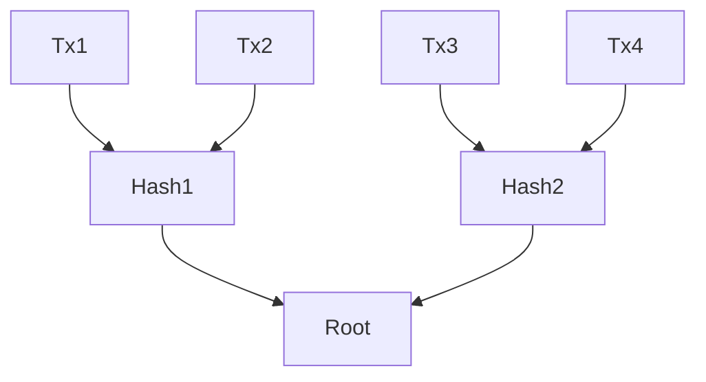

# Deep Dives: Merkle Roots, Wallet Structure, ChaCha Encryption, and Key Formats

## What is a Merkle Root?
A Merkle root is a single hash that summarizes all transactions in a block. It is computed by recursively hashing pairs of transaction hashes until only one remains. This enables efficient and secure verification of transactions.

**Diagram:**

## Wallet File Structure Changes
- **Legacy wallets:** Use `wallet.dat` (Berkeley DB), store all keys and metadata.
- **Descriptor wallets (v0.21.0+):** Use descriptors for flexible key management, improved backup, and recovery.
- **Major changes:**
  - v0.13.0 (2016): HD wallets
  - v0.21.0 (2021): Descriptor wallets

## ChaCha Encryption
- Used for fast, secure encryption (e.g., in BIP 324 for P2P transport encryption).
- ChaCha20 is a stream cipher: generates a pseudorandom stream, XORed with plaintext.

## Key Formats and Storage
- **Private keys:** 32 bytes (256 bits), stored in `wallet.dat` (legacy) or descriptor files.
- **Public keys:** 33 bytes (compressed), 65 bytes (uncompressed)
- **Addresses:** Encoded from public keys (Base58Check or Bech32)

## Database Schemas
- Wallets: Berkeley DB or SQLite (future)
- Chainstate: LevelDB

## Exercise
- Compute a Merkle root for a set of transactions (see `src/primitives/merkle.h`).
- Inspect your `wallet.dat` using the `bitcoin-wallet` tool.
- Research how ChaCha20 is used in Bitcoin Core.

---

*This deep dive is part of the two-week course. For more, see the folder READMEs and exercises.*
