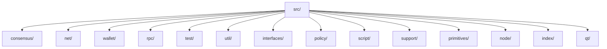
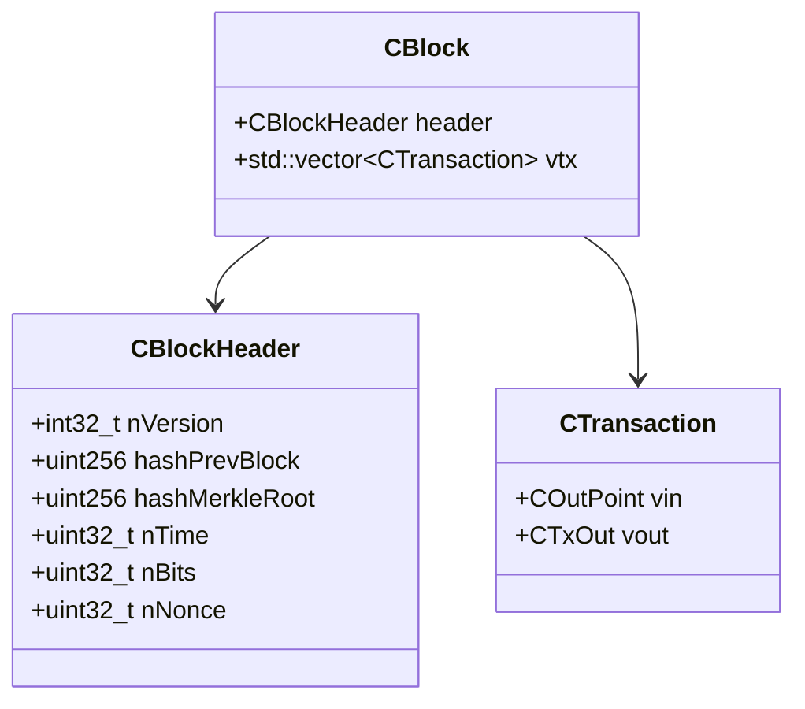

# Folder-by-Folder Tutorial for Bitcoin Core

This tutorial provides an overview of each major folder in the Bitcoin Core repository, with explanations suitable for junior to senior programmers. It includes instructions for running Bitcoin on testnet, adding testnet blocks, and visualizing the code structure.

## Table of Contents
- [Project Structure Overview](#project-structure-overview)
- [How to Run Bitcoin on Testnet](#how-to-run-bitcoin-on-testnet)
- [Adding Testnet Blocks](#adding-testnet-blocks)
- [Class Diagrams and Visuals](#class-diagrams-and-visuals)
- [Folder-by-Folder Guide](#folder-by-folder-guide)

---

## Project Structure Overview



---

## How to Run Bitcoin on Testnet

1. **Build Bitcoin Core**
   - Follow the instructions in `doc/build-windows.md` (for Windows) or `doc/build-unix.md` (for Linux/Mac).
   - Example (Windows, using CMake):
     ```powershell
     cmake -S . -B build
     cmake --build build --config Release
     ```
2. **Run bitcoind on testnet**
   - Navigate to the build output directory (e.g., `build/src/Release/`).
   - Start bitcoind in testnet mode:
     ```powershell
     .\bitcoind.exe -testnet
     ```
   - The data directory for testnet will be `%APPDATA%\Bitcoin\testnet3` by default.
3. **Connect with bitcoin-cli**
   - Use the CLI to interact with your testnet node:
     ```powershell
     .\bitcoin-cli.exe -testnet getblockchaininfo
     ```

---

## Adding Testnet Blocks

- Testnet blocks are mined like mainnet blocks, but with lower difficulty.
- To mine blocks on testnet:
  ```powershell
  .\bitcoin-cli.exe -testnet generatetoaddress 1 <your_testnet_address>
  ```
- You can also connect to public testnet peers to sync blocks automatically.

---

## Class Diagrams and Visuals

### Example: Core Class Relationships



- You can import these diagrams into [draw.io](https://app.diagrams.net/) or use [Mermaid Live Editor](https://mermaid.live/) for visualization.

---

## Folder-by-Folder Guide

### src/
- Main source code. Key classes: `CBlock`, `CTransaction`, `CChain`, `CWallet`, `CNode`.
- Entry point: `bitcoind` and `bitcoin-qt`.


    <TODO: Copilot create a README.md inside of the following subdirectories >
    => policy  (what are the classes, and inheritence)
    => primitives  (explain the data types)
    => secp256k1
    => test    
    => univalue
    => util      (which)
    => wallet   (what are the dates/releases of major file structural changes)
    => common  (what classes are new/old?)
    => consensus
    => policy ( what does ephemeral mean?)
    => kernel  ()
    => index   (what kind of index is this, what are the big-o(n) implications on algorithm speeds)
    => init    (what is required for initialization)

    <TODO: Copilot explain in depth what a merkel root is, the release dates of major changes to wallet file structure, how chacha encryption works, what are the formats and lengths of private keys, public keys and where are each stored.  Review any database schemas this should be a two week course full-time students learn for an 2 hour final at the end>

---

## More Resources
- [Bitcoin Developer Documentation](https://developer.bitcoin.org/devguide/)
- [Bitcoin Core Docs](https://bitcoincore.org/en/doc/)

---

*This tutorial is a starting point. For detailed class diagrams and flowcharts, see the visuals above and explore the `src/` folder for implementation details.*
