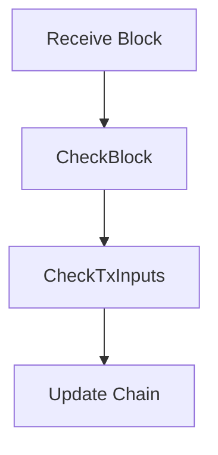

# consensus/

## Purpose
Implements the consensus rules for Bitcoin, including block validation and chain selection.

## Key Classes
- `Consensus::Params`: Consensus parameters
- `CheckBlock`, `CheckTxInputs`: Block and transaction validation

## Flowchart: Block Validation

## Exercise
- Trace the block validation process in the codebase.
- What happens if a block fails validation?

[Next: wallet/README.md](../wallet/README.md)
