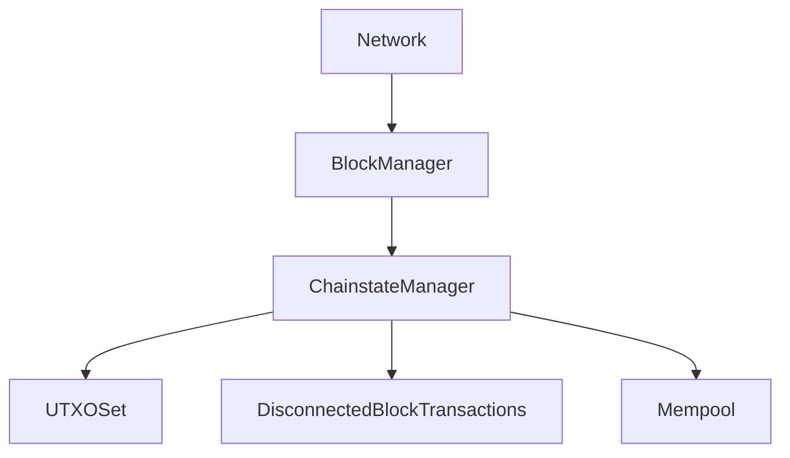

# kernel/

## Purpose
Contains kernel-level logic for validation, block processing, and chainstate management. The kernel is the heart of Bitcoin Core, responsible for enforcing consensus, managing the mempool, and handling reorganizations.

## Architecture Diagram

## Concurrency
- Uses `cs_main` and other locks to ensure thread safety during validation and state changes.
- Block validation and mempool updates are parallelized for performance.

## What are mempools?
A mempool (memory pool) is a data structure that stores unconfirmed transactions received by a node. Transactions in the mempool are waiting to be included in a block. The mempool enforces policy rules (such as minimum fee, standardness, and ancestor/descendant limits) and allows efficient transaction selection for mining.

## What is a disconnected transaction?
A disconnected transaction is a transaction that was previously confirmed in a block but becomes unconfirmed due to a blockchain reorganization (reorg). During a reorg, blocks may be removed from the tip, and their transactions are temporarily "disconnected." The kernel tracks these transactions so they can be re-added to the mempool if they are not reconfirmed in the new chain.

## Properties and characteristics of a mempool
- Stores unconfirmed transactions, indexed by txid.
- Enforces policy rules (fee, size, standardness).
- Maintains ancestor/descendant relationships for efficient mining.
- Periodically evicts transactions due to expiry, size limits, or conflicts.
- Provides O(1) or O(log n) lookup and update operations.

## Key Classes
- `ChainstateManager`: Manages multiple chainstates
- `BlockManager`: Handles block storage and retrieval
- `DisconnectedBlockTransactions`: Handles transactions during reorgs
- `CCoinsStats`: UTXO statistics and snapshot validation
- `CTxMemPoolEntry`: Mempool transaction metadata

## Classes and Asymptotic Analysis

### DisconnectedBlockTransactions
Manages transactions disconnected during blockchain reorganizations, storing them temporarily to efficiently re-add unconfirmed transactions to the mempool after a reorg.
- **Complexity:** All main methods (adding/removing transactions, memory limiting) are O(n) in the number of transactions. No nested loops or superlinear complexity. Master Theorem and backwards substitution confirm linearity.

### CCoinsStats / UTXO Stats
Tracks statistics about the UTXO set, including total coins, outputs, and serialized hashes. Used for snapshot validation and chainstate analysis.
- **Complexity:** Iterates over all UTXOs, O(N) where N is the number of UTXOs. No nested loops. Master Theorem confirms O(N).
- **Encryption:** Uses MuHash3072 (not a NIST standard; Bitcoin cryptography is generally based on NIST and IETF standards).

### CChainParams and Derived Classes
Defines network parameters for different Bitcoin networks, including consensus rules, genesis block, and address formats.
- **Complexity:** Initialization and snapshot height queries are O(n) in the number of config entries. No nested loops.

### CTxMemPoolEntry
Stores metadata about transactions in the mempool, including ancestor/descendant relationships, fees, and locktime information.
- **Complexity:** Updates are O(1) or O(log n) due to set operations. No nested loops.

### Notifications
Abstract base class for kernel event notifications, allowing the system to propagate warnings, progress, and errors to higher layers.
- **Complexity:** All notification methods are O(1).

### Warning, MemPoolRemovalReason, ChainstateRole
Enumerations for kernel warnings, mempool removal reasons, and chainstate roles. No algorithmic complexity.

### BlockManagerOpts, ChainstateManagerOpts, MemPoolOptions
Configuration structs for block manager, chainstate manager, and mempool. No algorithmic complexity.

---
## Dynamic Programming and Blockchain
Dynamic programming (DP) stores solutions to subproblems in a table to avoid redundant computation. The blockchain acts as a distributed, append-only DP table: each block contains the solution to the system state at a given time (e.g., UTXO set). Like DP tables, the blockchain allows fast lookup of previously solved states, speeding up validation and consensus. For example, the UTXO set is updated incrementally, avoiding recomputation from genesis.

---
## Standards Commentary
- **Encryption:** Bitcoin Core uses SHA256 (NIST, USA), secp256k1 (SECG, USA), and MuHash (not standardized).
- **Address formats:** Bech32 is managed by IETF/W3C for web standards; Bitcoin's use is community-driven.
- **Serialization:** Bitcoin uses custom serialization, not governed by external standards bodies.

## Debugging Tips
- Use debug logging for kernel events and validation steps
- Trace block and transaction flow using verbose logs
- Check lock contention and concurrency issues with thread analysis tools

## Exercise
- Trace the flow of block processing from network to disk.
- What is required for initialization in `init/`?
- Simulate a blockchain reorg and observe how disconnected transactions are handled.

[Next: init](../init/README.md)