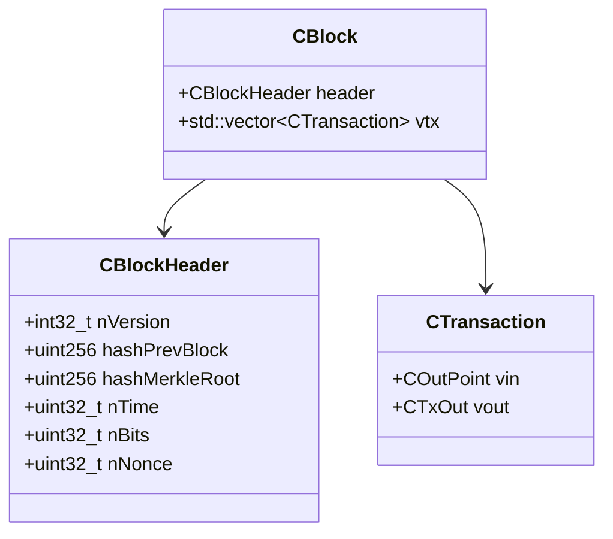

# primitives/

## Purpose
Defines the fundamental data types used throughout Bitcoin Core, such as blocks, transactions, and cryptographic primitives.

## Key Classes
- `CBlock`, `CBlockHeader`: Block structure
- `CTransaction`, `COutPoint`, `CTxIn`, `CTxOut`: Transaction structure
- `uint256`, `arith_uint256`: 256-bit integers

## Class Diagram

## Exercise
- Locate and read the definitions of `CBlock` and `CTransaction` in the codebase.
- Write a short summary of how a Bitcoin block is structured.

[Next: consensus](../consensus/README.md)
